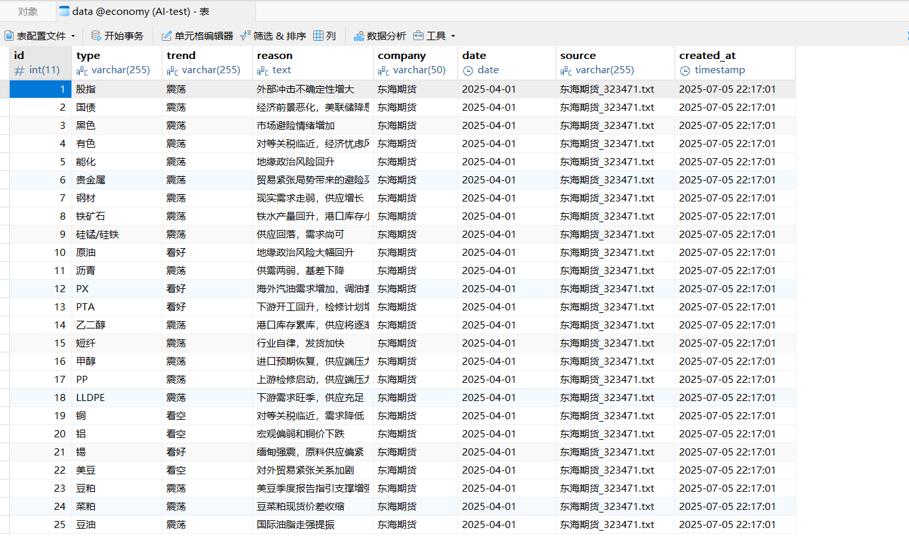
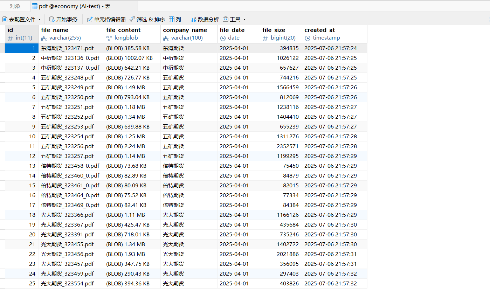

# **期货数据分析系统**


原始数据下载：[economy_origin (kaggle.com)](https://www.kaggle.com/datasets/rexinshiminxiaozhou/ai-economy/data)

HTML -> PDF 后的数据（PDF 格式）下载：[economy_pdf (kaggle.com)](https://www.kaggle.com/datasets/rexinshiminxiaozhou/economy-data)

PDF -> TXT 后的数据（TXT 格式）下载：[economy_txt (kaggle.com)](https://www.kaggle.com/datasets/rexinshiminxiaozhou/futures-data)

==ps：项目中使用的数据集信息**仅供学习使用**，**请勿商用盈利**，**违者必究**！==


## 项目介绍

项目包括前端网站和后端数据库管理两个部分组成，使用特定的（时间为 2025-04-01到2025-04-29）包含HTML、PDF两种格式文件的数据集（7183个文件），经过格式转化、数据清洗和文本数据特征提取后，存入后端 MySQL数据库；建立前端网站，能够手动选择日期和期货类型，观察期货在过去一个月的涨跌情况和涨跌原因。

## 功能特点
- [x] 期货市场涨跌情况统计图表
- [x] 每日市场观点分析
- [x] PDF报告生成与查看
- [x] 数据筛选功能


## 数据部分文件夹格式

```makefile
Futures_Analysis/
├── data/                  # 原始数据集目录
    ├── 20250401/          # 第一个日期文件夹
        ├── 宝城期货_323209.PDF     # PDF文件示例
        ├── ...
        ├── 倍特期货_323458_0.html  # HTML文件示例
        ├── ...
          ...
    ├── 20250429/          # 最后一个日期文件夹
        ├── ...
├── data-example/                  # 数据集示例文件夹
    ├── HTML-example/              # HTML示例
        ├── 倍特期货_323458_0.html  # 原html
        ├── 倍特期货_323458_0.pdf   # html->pdf
        ├── 倍特期货_323458_0.txt   # md->txt
        └── 倍特期货_323458_0/      # mineru转化后的包含md文件的文件夹
            ├── 86a9bf..._content_list.json  # 内容列表文件
            ├── 86a9bf..._origin.pdf         # 原始pdf
            ├── full.md                      # 转换后的md文件
            ├── images/                      # pdf文件中包含的图片
            └── layout.json                  # 布局配置文件
    └── PDF-example/      # PDF示例
        ├── 宝城期货_323209.PDF     # 原PDF
        ├── 宝城期货_323209.txt     # md->txt
        └── 宝城期货_323209/        # mineru转化后的包含md文件的文件夹
            ├── 1ff74f..._content_list.json
            ├── 1ff74f..._origin.pdf 
            ├── full.md
            ├── images/
           └── layout.json
├── output_pdf/    # pdf输出目录
    ├── ...
├── output_final/  # txt输出目录（最终mysql入库的文件格式）
    ├── ...
└── img/           # 项目相关图片
```

## 代码部分文件夹格式

```makefile
Futures_Analysis/
├── src/
	├── app.py                # 主应用入口文件，包含Flask/Django等web应用配置
	├── deepseek.ipynb        # 使用 DeepSeek 分析我的md文件得到txt文件
	├── html-pdf.ipynb        # HTML->PDF
	├── mysql_pdf.py          # MySQL数据库存储PDF
	├── mysql_txt.py          # MySQL数据库TXT
	├── pdf-md-txt.ipynb      # PDF->Markdown->TXT
	└── pdf-md.ipynb          # PDF->Markdown
├── templates/
	└── index.html            # 前端代码
├── demo.mp4                  # 演示视频
├── company.txt               # 公司映射文件
├── requirements.txt      
└── README.md
```


## 快速开始

确保安装：

Python>=3.8

MySQL数据库

安装依赖包：

```bash
pip install -r requirements.txt
```

配置数据库连接信息：

```python 
db_config = {
    'host': 'localhost',
    'user': 'xxx',
    'password': 'xxx',
    'database': 'xxx',
    'charset': 'utf8mb4',
    'cursorclass': pymysql.cursors.DictCursor
}
```

运行后端服务：

```bash
python src/app.py
```

访问前端界面： http://localhost:5000


## 运行展示

我使用 **Navicat Premium 17** 中的 MySQL 数据库功能存储我的期货数据

基础数据展示：



PDF文件展示：



前端运行视频：

详见demo.mp4

<video src="./demo.mp4"></video>

关于数据集和代码的解读或是更多信息，欢迎关注我的博客：

